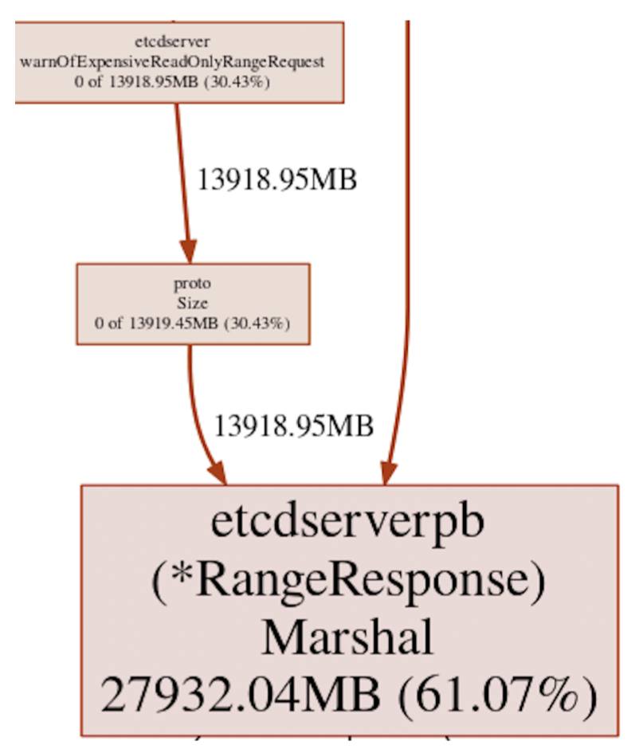
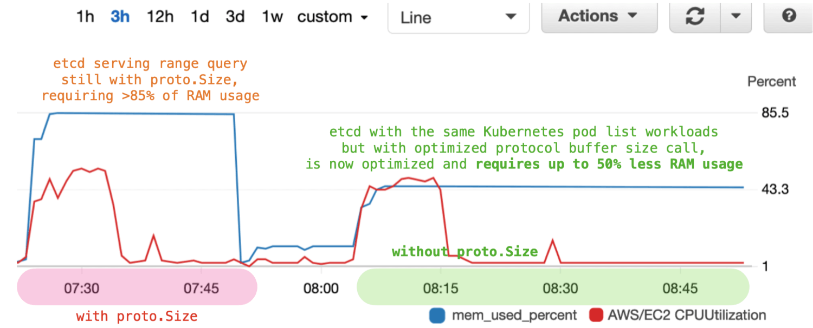
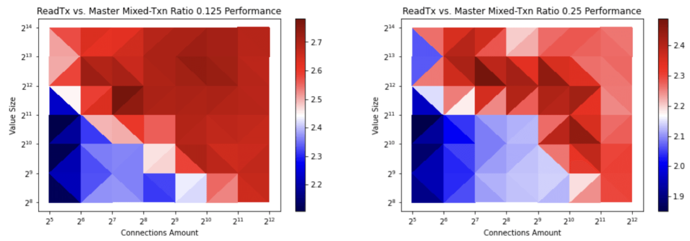
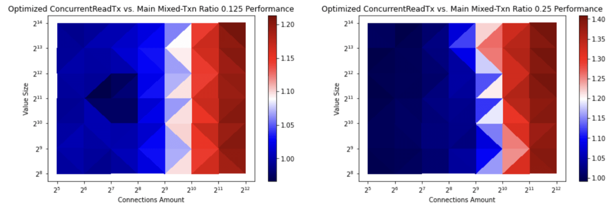
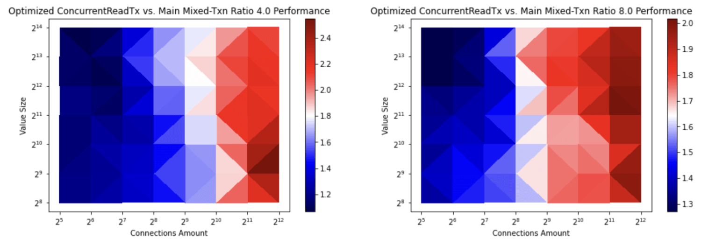
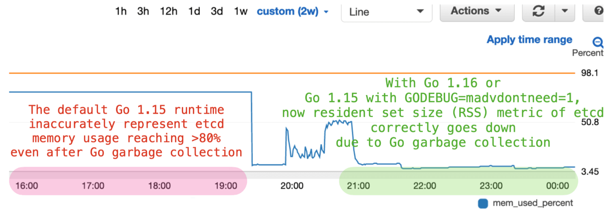
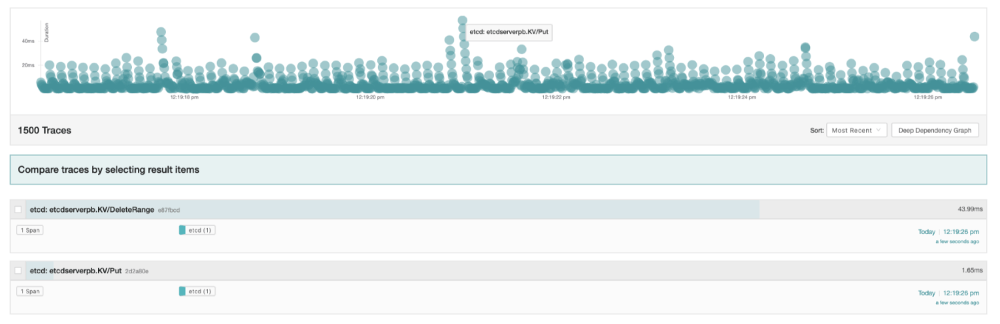
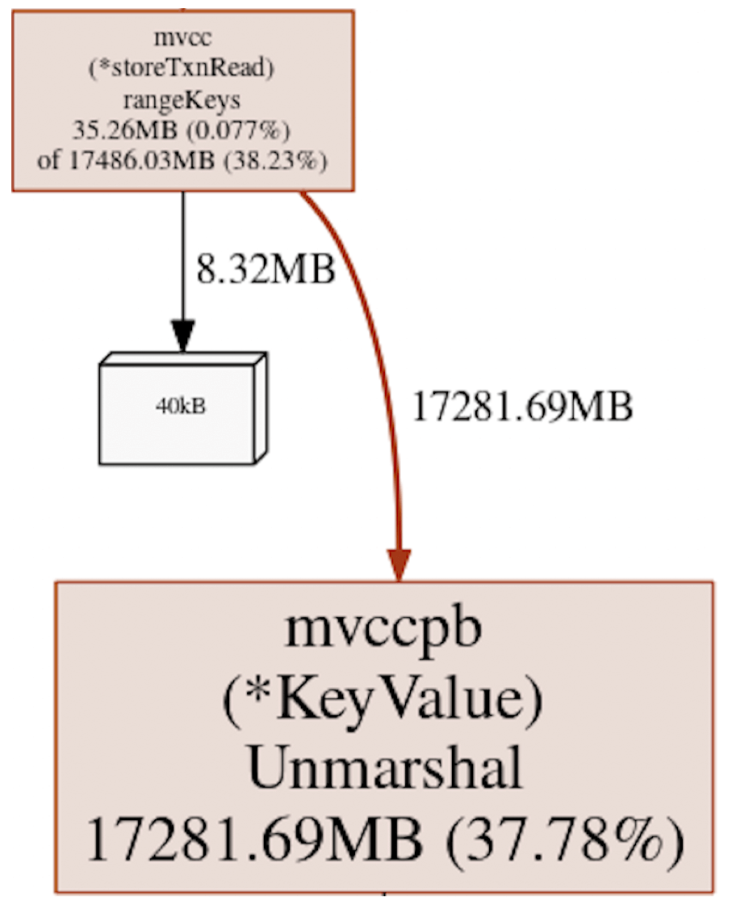

**Authors:** Gyuho Lee (Amazon Web Services, [github.com/gyuho](https://github.com/gyuho))

When we launched [etcd 3.4](https://github.com/etcd-io/etcd/releases/tag/v3.4.0) back in August 2019 (see ["Announcing etcd 3.4"](https://kubernetes.io/blog/2019/08/30/announcing-etcd-3-4/)), it focused on storage backend improvements, non-voting member and pre-vote features. Today, etcd is more widely used for various mission critical clustering and database applications and as a result, its feature set grew more broad and complex. Thus, improving its stability and reliability has been top priority for recent development.

Today, we are releasing [etcd 3.5](https://github.com/etcd-io/etcd/releases/tag/v3.5.0). The past two years allowed for extensive iterations in fixing numerous bugs, identifying optimization opportunities at scale, and evolving its surrounding ecosystem. And the release is the result of continuous evolution and grungy, thankless tasks done by etcd community.

This reviews notable changes in etcd 3.5 release and presents its project roadmap for the next. Please see [CHANGELOG 3.5](https://github.com/etcd-io/etcd/blob/master/CHANGELOG-3.5.md) for full lists of changes. You can get it from the [download page](https://github.com/etcd-io/etcd/releases/tag/v3.5.0) and follow [etcdio@ at Twitter](https://twitter.com/etcdio) for more updates.

## Security

Given that etcd often handles sensitive data, improving and maintaining security posture is our highest priority. In order to have a comprehensive understanding of etcd security landscape, we completed third-party security audits: The first report was published in February 2020, where we identified (and fixed) various edge cases and high severity issues (see [security audit report](https://github.com/etcd-io/etcd/blob/master/security/SECURITY_AUDIT.pdf)).

To adhere to the highest levels of security best practices, etcd now has a [security release process](https://github.com/etcd-io/etcd/blob/master/security/security-release-process.md), and runs automated tests with static analysis tools, such as errcheck, ineffassign, and others.

## Features

The **migration to structured logging is complete**. etcd now defaults to [zap](https://github.com/uber-go/zap) logger that has a reflection-free, zero-allocation JSON encoder, and deprecated [capnslog](https://github.com/coreos/pkg/issues/57) that logged with reflection-based serialization. 

**etcd now supports built-in log rotation** that configures rotate thresholds, compression algorithms, etc. -- see [hexfusion@'s code change (from Red Hat)](https://github.com/etcd-io/etcd/pull/12774).

**etcd now emits more detailed tracing information for expensive requests**, as such:

> "caller":"traceutil/trace.go:116","msg":"trace[123] range","detail":"{range_begin:foo; range_end:fooo; response_count:100000; response_revision:191496;}","duration":"132.449773ms","start":"...:32.611-0700","end":"...:32.744-0700","steps":["trace[123] step 'range keys from bolt db' (duration: 92.521911ms)","trace[123] step 'filter and sort the key-value pairs' (duration: 22.789099ms)"]}

This provides a very useful signal for understanding the lifetime of a request spanning multiple etcd server components. See [YoyinZyc@'s code change (from Google)](https://github.com/etcd-io/etcd/pull/11179).

Each etcd cluster maintains its own cluster version, a value agreed by the quorum of the cluster. Previously, downgrading such cluster versions (e.g., etcd minor version from 3.5 to 3.4) was not supported in order to protect against incompatible changes. Let's say we allow 3.3 node to join 3.4 cluster and send a lease checkpoint request to the leader, which was introduced only in etcd 3.4. When 3.3 node receives the lease checkpoint request, it will panic, failing to handle the unknown apply request (see [etcd server apply code](https://github.com/etcd-io/etcd/blob/v3.3.25/etcdserver/apply.go#L119-L170)). However, one may not use such lease checkpointer feature and is **willing to risk incompatible changes in order to perform emergency rollbacks** (e.g., major defect in new etcd versions). To ensure such rollbacks are easy and reliable, we've added a **downgrade API that validates, enables, and cancels etcd version downgrades**. See [YoyinZyc@'s code change (from Google)](https://github.com/etcd-io/etcd/pull/11715).

etcd cluster membership is applied with the same level of consistency as writes, by requiring quorum agreement. But previously, member list call was directly served from the server's local data, which may be stale. Now, **etcd serves member list with a linearizable guarantee -- if the server is disconnected from quorum, the member list call will fail**. See [jingyih@'s code change (from Google)](https://github.com/etcd-io/etcd/pull/11639).

**gRPC gateway endpoint is now stable under `/v3/*`**. gRPC gateway generates HTTP API to make etcd gRPC-based HTTP/2 protocol accessible via HTTP/1, as such:

> curl -X POST -L http://localhost:2379/v3/kv/put -d '{"key": "Zm9v", "value": "YmFy"}'

**etcd client now uses latest gRPC v1.32.0 and migrated to upstream balancer implementation** -- see [ptabor@'s code change (from Google)](https://github.com/etcd-io/etcd/pull/12671), and **requires a new import path `"go.etcd.io/etcd/client/v3"`**.

## Bug fixes

etcd reliability and correctness are of utmost importance. That is why we backport all critical bug fixes to previous etcd releases. That said, these are the notable bugs we identified (and fixed) during etcd 3.5 development: (1) lease objects piling up caused memory leaks, and the fix was to clear expired lease queue in the old leader -- see [tangcong@'s fix (from Tencent)](https://github.com/etcd-io/etcd/pull/11731), (2) ongoing compact operation caused deadlock in mvcc storage layer -- [tangcong@'s fix (from Tencent)](https://github.com/etcd-io/etcd/pull/11817), (3) etcd server restart had redundant backend database open operations and as a result, reloading 40-million keys took over 5-minute, and the fix reduced the restart time by half -- [tangcong@'s fix (from Tencent)](https://github.com/etcd-io/etcd/pull/11779), (4) if etcd crashed before completing defragment, the next defragment operation might have read the corrupted file, and the fix was to ignore and overwrite the existing file -- see [jpbetz@'s fix (from Google)](https://github.com/etcd-io/etcd/pull/11613), (5) client cancelling watch does not signal server creating leaky watchers, and the fix was to explicitly send a cancel request to the server -- see [jackkleeman@'s fix (from Apple)](https://github.com/etcd-io/etcd/pull/11613).

## Performance

Kubernetes, the most prominent user of etcd, queries the entire keyspace to list and watch its cluster resources. This range query happens whenever the resource is not found in kube-apiserver's reflector cache (e.g., requested etcd revision has been compacted, see [kube-apiserver v1.21 code](https://github.com/kubernetes/kubernetes/blob/v1.21.0/staging/src/k8s.io/client-go/tools/cache/reflector.go#L302-L312)), often causing slowness in reads from overloaded etcd servers (see [github issue](https://github.com/etcd-io/etcd/issues/12678)). In such case, kube-apiserver tracing warns as below:

> "List" url:/api/v1/pods,user-agent... (started: ...) (total time: 1.208s): Trace[...]: [1.208s] [1.204s] Writing http response done count:4346

And etcd warns

> etcdserver: read-only range request key:"/registry/pods/" range_end:"/registry/pods0" revision:... range_response_count:500 size:291984 took too long (723.099118ms) to execute

Our deep-dive into etcd heap profile uncovered major inefficiency in server warning logger that had a redundant encoding operation only to compute the size of range responses with [`proto.Size`](https://github.com/gogo/protobuf/blob/v1.3.2/proto/table_marshal.go#L2913-L2931) call. As a result, **a large range query had up to 60% heap allocation overhead, thus causing out-of-memory crashes (OOM) in overloaded etcd servers** (see *Figure 1*). Then we **optimized the protocol buffer message size operation** and as a result, **reduced etcd memory consumption up to 50% during peak** (see *Figure 2*). It was a set of small code changes, but for years, such performance gold was invisible without extensive testing and workload simulation. See [chaochn47@'s investigation (from Amazon Web Services)](https://github.com/etcd-io/etcd/issues/12835) and [patch to replace `proto.Size` calls](https://github.com/etcd-io/etcd/pull/12871).

etcd 3.4 release made backend read transactions fully concurrent by copying transaction buffers rather than sharing between writes and concurrent reads (see [code change from 3.4 release](https://github.com/etcd-io/etcd/pull/10523)). However, such buffering mechanism comes with unavoidable copy overhead and negatively impacted write-heavy transaction performance, as creating concurrent read transactions acquires a mutex lock which then blocks incoming write transactions. etcd 3.5 made multiple improvements to further increase the transaction concurrency: (1) If a transaction includes a PUT(update) operation, the transaction instead shares the transaction buffer between reads and writes (same behavior as 3.4) in order to avoid copying buffers. This transaction mode can be disabled via `etcd --experimental-txn-mode-write-with-shared-buffer=false`. The benchmark results show that the **transaction throughput with a high write ratio has increased up to 2.7 times by avoiding copying buffers when creating a write transaction** (see *Figure 3* and *4*). Which **benefits all kube-apiserver create and update calls that use etcd transactions** (see [etcd3 store v1.21 code](https://github.com/kubernetes/kubernetes/blob/v1.21.0/staging/src/k8s.io/apiserver/pkg/storage/etcd3/store.go#L394-L401)). See [wilsonwang371@'s code change and benchmark results (from ByteDance)](https://github.com/etcd-io/etcd/pull/12896).

(2) etcd now caches the transaction buffer to avoid the unnecessary copy operations. This speeds up concurrent read transaction creation and as a result, the **transaction with a high read ratio has increased up to 2.4 times** (see *Figure 5* and *6*). See [wilsonwang371@'s code change and benchmark results (from ByteDance)](https://github.com/etcd-io/etcd/pull/12933).

## Monitoring

Long-running load tests revealed that etcd server misrepresented its real memory usage by masking the impact of Go garbage collection. Upon diving into this discrepancy, we discovered that etcd server with Go 1.12 changed the runtime to use `MADV_FREE` in Linux kernel, and as a result, reclaimed memory was not reflected in the resident set size (RSS) metric. This had made the etcd memory usage metric inaccurately static thus showing no sign of Go garbage collection. To fix this monitoring problem, we compile etcd 3.5 with Go 1.16 that defaults to `MADV_DONTNEED` on Linux (see [github issue](https://github.com/golang/go/issues/42330) and *Figure 7*).

Monitoring is fundamental to service reliability and observability. Monitoring enables individual service owners to understand its current state and identify possible causes for problem reports -- such engineering discipline is referred to as telemetry. The goal is to detect problems with early warning signals and explain such metrics to diagnose the issue. etcd has server logs with tracing information and publishes Prometheus metrics. This information, combined with our knowledge of how etcd systems are built, gives enough to determine the service impact and its possible causes. However, when a request call chain spans multiple external components (e.g., from kube-apiserver to etcd), it is harder to identify the culprit. In order to efficiently identify the root cause, we added distributed tracing support using [OpenTelemetry](https://opentelemetry.io): When the **distributed tracing is enabled, etcd now uses OpenTelemetry to produce a trace across the RPC call chain and thus can easily be integrated with its surrounding ecosystem**. See *Figure 8* and [lilic@'s proposal (from Red Hat)](https://github.com/etcd-io/etcd/pull/12919) and [github issue](https://github.com/etcd-io/etcd/issues/12460).

## Testing

Distributed systems are full of subtle edge cases. The fact that a bug may only emerge under special circumstances warrants exhaustive test coverage beyond simple unit testing. etcd runs integration, end-to-end, and failure injection tests, which provide a reliable and faster way to validate each change. However, as development continued with extended feature sets, flaky tests quickly piled up draining our productivity. So, we took on the series of arduous tasks that often required multiple hours of debugging to root cause the failures and improve test quality. Some notable changes are: [reduce unit tests runtime by half](https://github.com/etcd-io/etcd/pull/12286), [configure test logger](https://github.com/etcd-io/etcd/pull/12753), [simplify test data cleanup](https://github.com/etcd-io/etcd/pull/12805), [close gRPC servers after tests](https://github.com/etcd-io/etcd/pull/12782), etc..

## Platforms

etcd presubmit tests are now fast and reliable, but were mostly running on x86 processors. And there have been numerous requests to support other architectures like ARM (see [github issue](https://github.com/etcd-io/etcd/issues/12852)) and s390x (see [github issue](https://github.com/etcd-io/etcd/issues/11163)). [Self-hosted GitHub action runner](https://docs.github.com/en/actions/hosting-your-own-runners/adding-self-hosted-runners) provides a consistent way of hosting various external test workers (see [github issue](https://github.com/etcd-io/etcd/issues/12856)). Using the GitHub action, etcd now [**runs tests on ARM-based AWS EC2 instances (Graviton)**](https://github.com/etcd-io/etcd/pull/12928), thereby [**officially supporting ARM64 (aarch64) platform**](https://github.com/etcd-io/etcd/pull/12929). In addition, we introduced a mechanism to support other platforms and **categorized support tiers based on testing coverage** (see [document](https://github.com/etcd-io/website/pull/273)).

## Developer experience

To better support the integration with external projects, **etcd now fully adopts the [Go 1.16 module](https://github.com/golang/go/wiki/Modules)**. This may sound simple but in practice, existing monolithic codebase made migration extremely difficult, causing friction of adoption in the community (see [github issue](https://github.com/etcd-io/etcd/issues/12484)). Tooling is an important part of etcd development and as a result, relying on an outdated vendoring system was degrading our contributor experience. Using Go module enables clear separation between server and client code, ease of change management for dependency updates, and verifiable build system without convoluted codebase for vendoring. With reproducible builds in place, we finally eliminated the need for vending dependency and as a result, we **reduced etcd codebase size by half**. See [ptabor@'s modularization proposal (from Google)](https://docs.google.com/document/d/19UvKD7by_fEkzLMRi-QNSKEed4kYAW286S3DsNRPDOM/edit) and [code change to remove `vendor` directory](https://github.com/etcd-io/etcd/pull/12279).

To better isolate dependency trees, etcd command-line interface now has a new administrative tool **`etcdutl` (not `etcdut-i-l`)**, and the sub-commands includes **`etcdutl snapshot`** and **`etcdutl defrag`**: The **`etcdctl snapshot` and `etcdctl defrag` commands in previous releases are deprecated**. This change aligns well with the new Go module layouts: `etcdctl` solely relies on client v3 libraries, whereas `etcdutl` may depend on etcd server-side packages, such as bolt and backend database code. See [ptabor@'s code change (from Google)](https://github.com/etcd-io/etcd/pull/12971).

To support [inclusive naming initiatives](https://inclusivenaming.org), etcd projects renamed the default branch `master` to `main` (see [`etcd-io/etcd` change](https://github.com/etcd-io/etcd/pull/12956) and [`etcd-io/website` change](https://github.com/etcd-io/website/issues/149)). The migration was seamless as GitHub handles the necessary redirects (see [github renaming](https://github.com/github/renaming)).

Each etcd write incurs an append message in Raft thus fsynced to disk. Such persistence may not be desired for testing. To work around this, we've added `etcd --unsafe-no-fsync` flag to bypass disk writes for Raft WAL entries. See [crawshaw@'s code change (from Tailscale)](https://github.com/etcd-io/etcd/pull/11946) and [github issue](https://github.com/etcd-io/etcd/issues/11930).

## Community

The diversity of end users keeps expanding: Cloudflare relies on etcd for managing its data centers (see [blog post in November 2020](https://blog.cloudflare.com/a-byzantine-failure-in-the-real-world)), Grafana Cortex stores its configuration data in etcd (see [blog post in April 2020](https://grafana.com/blog/2020/04/07/how-a-production-outage-in-grafana-clouds-hosted-prometheus-service-was-caused-by-a-bad-etcd-client-setup)), Netflix [Titus](https://netflix.github.io/titus/) uses etcd for managing its container workloads (see [slides in November 2020](https://www.slideshare.net/aspyker/herding-kats-netflixs-journey-to-kubernetes-public)), Tailscale runs its control plane on top of etcd (see [blog post in January 2021](https://tailscale.com/blog/an-unlikely-database-migration)).

Such pace of adoption is no surprise given the extended team of our vendor contributors. In etcd 3.5 release, we've [added two core maintainers](https://github.com/etcd-io/etcd/pull/12624): Wenjia Zhang (Google, [github.com/wenjiaswe](https://github.com/wenjiaswe)) who's been leading etcd community meetings and Kubernetes integration, and Piotr Tabor (Google, [github.com/ptabor](https://github.com/ptabor)) who's been leading numerous bug fixes and codebase modularization work. The diversity of contributors is key to building a sustainable, welcoming open source project and fostering manageable work environments.

See [CNCF etcd project journey report 2021](https://www.cncf.io/cncf-etcd-project-journey-report) for more.

## New etcd.io

Since etcd joined [Cloud Native Computing Foundation](https://www.cncf.io) (CNCF) in December 2018 (see [blog post](https://www.cncf.io/blog/2018/12/11/cncf-to-host-etcd/)), we have refactored all user-facing documents into a stand-alone repository [etcd-io/website](https://github.com/etcd-io/website) and modernized its website hosting with Hugo (see [code change](https://github.com/etcd-io/website/pull/244)). The migration was a huge undertaking that required multiple months of engineering efforts and communication between maintainers. The very blog post you are reading now is hosted on the new [etcd.io](https://etcd.io/blog), thanks to [lucperkins@](https://github.com/lucperkins), [chalin@](https://github.com/chalin), [nate-double-u@](https://github.com/nate-double-u) (from CNCF) and many other community contributors.

## Future roadmaps

Traffic overloads can cause cascading node failures and as a result, scaling such clusters becomes challenging and may impair its ability to recover from quorum loss. With so many mission critical systems built on top of etcd, defending etcd against overload is paramount. We will revisit the **etcd throttle feature to shed excessive loads gracefully** -- currently the etcd project has two pending rate-limiter proposals: [vivekpatani@'s proposal (from Apple)](https://docs.google.com/document/d/1wQQ_L3cLyI1t14zp-PvarbjJYtlRsz_P9LwDR3uelc8/edit#heading=h.jofsq6eav4x7) and [tangcong@'s proposal (from Tencent)](https://github.com/etcd-io/etcd/pull/12290).

Large range query from kube-apiserver is still the most troubling source of process crash today, as it is relatively unpredictable. Our heap profile on such workload found that **etcd range request handler decodes and holds the entire response before sending it out to gRPC server, adding up to 37% heap allocation** -- see *Figure 9* and [chaochn47@'s investigation (from Amazon Web Services)](https://github.com/etcd-io/etcd/issues/12835). Paginating range calls in client code is not enough, because it entails additional consistency considerations and still requires full relists for expired resources (see [kube-apiserver v1.21 code](https://github.com/kubernetes/kubernetes/blob/v1.21.0/staging/src/k8s.io/client-go/tools/cache/reflector.go#L302-L312)). To work around this inefficiency, **etcd needs to support range streams**. We will revisit [yangxuanjia@'s range stream proposal (from JD)](https://github.com/etcd-io/etcd/pull/12343), as it requires a significant amount of work to introduce such semantic changes both in etcd and downstream projects.

We've made a decision to **completely deprecate the etcd v2 API in favor of a more performant and widely adopted v3 API**, in order to reduce the maintenance burden. And the v2 storage translation layer via `etcd --experimental-enable-v2v3` remains experimental in 3.5 and to be removed in the next release. See [ptabor@'s proposal (from Google)](https://github.com/etcd-io/etcd/issues/12913).

Historically, etcd release has been quite costly, due to its being relatively infrequent and often representing a large delta. This is partially because of lack of release automation. We will **develop an automated release system** that is more accessible to the community.
